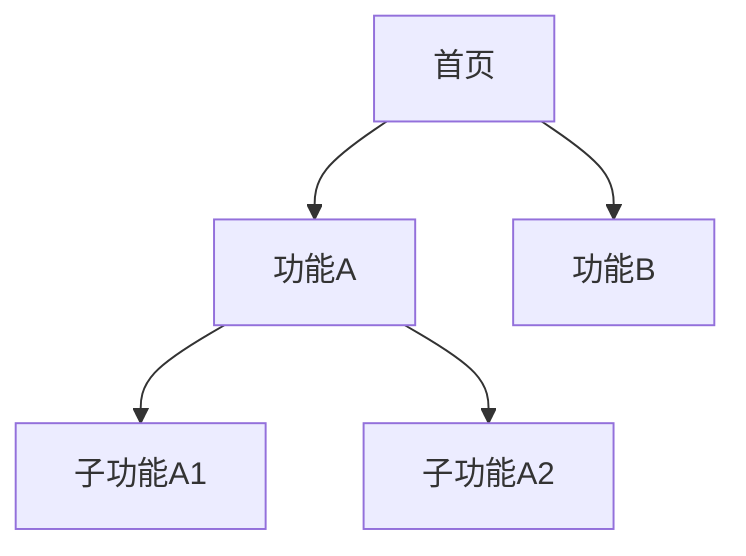
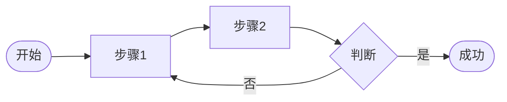
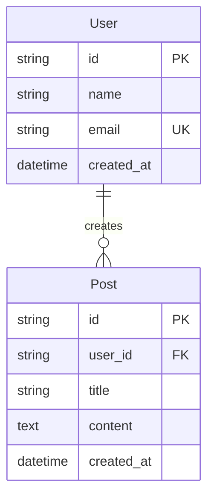

# 方案设计指南

采用**用户体验要素**，从抽象到具体逐层推进。

---

## 四层产出

```text
1. Strategy  战略层  → 1_strategy.md   （为什么做）
2. Scope     范围层  → 2_scope.md      （做什么）
3. Structure 结构层  → 3_structure.md  （怎么组织）- Mermaid 图
4. Prototype 原型层  → prototype/      （什么样子）- 高保真 HTML
```

**四层确认后，合并生成 `app_spec.txt`，作为开发阶段的唯一输入。**

---

## 各层详细说明

### Layer 1: Strategy 战略层

**产出**：`1_strategy.md`

**内容**：
- 产品目标
- 目标用户
- 核心价值
- 成功标准

---

### Layer 2: Scope 范围层

**产出**：`2_scope.md`

**内容**：
- MVP 功能列表
- 后续迭代功能
- 明确不做的事
- 技术选型

---

### Layer 3: Structure 结构层

**产出**：`3_structure.md`

**内容**：

1. **信息架构**（Mermaid Graph）


2. **用户流程**（Mermaid Flowchart）


3. **数据模型**（Mermaid ER Diagram + 表结构）



**表结构详细说明**（每个实体单独描述）：

| 表名 | 字段 | 类型 | 约束 | 说明 |
|-----|------|------|------|------|
| users | id | uuid | PK | Clerk user_id |
| | email | varchar(255) | UK, NOT NULL | |
| | name | varchar(100) | | |
| | created_at | timestamp | DEFAULT now() | |

4. **API 设计**

| 方法 | 路径 | 说明 | 请求体 | 响应 |
|-----|------|------|-------|------|
| GET | /api/users/me | 获取当前用户 | - | `{id, name, email}` |
| POST | /api/posts | 创建文章 | `{title, content}` | `{id, title}` |
| GET | /api/posts | 获取文章列表 | - | `[{id, title, ...}]` |

**错误响应格式**：
```json
{
  "error": {
    "code": "UNAUTHORIZED",
    "message": "Invalid token"
  }
}
```

---

### Layer 4: Prototype 原型层

**产出**：`prototype/` 目录

**内容**：
- 高保真 HTML + Tailwind CSS 页面
- 可直接在浏览器预览
- 包含交互状态（hover、active、loading 等）

**目录结构**：
```text
prototype/
├── index.html          # 入口/首页
├── page-a.html         # 页面A
├── page-b.html         # 页面B
└── components.html     # 组件库预览
```

**预览方式**：
```bash
open prototype/index.html
# 或
npx serve prototype
```

---

### 合并产出: app_spec.txt

**原型确认后**，将 1-4 层内容合并生成 `app_spec.txt`：

```text
solution/
├── 1_strategy.md
├── 2_scope.md
├── 3_structure.md
├── prototype/
└── app_spec.txt     ← 合并生成，作为开发输入
```

**app_spec.txt 结构**：
```xml
<project_specification>
  <strategy>
    <!-- 来自 1_strategy.md -->
  </strategy>

  <scope>
    <!-- 来自 2_scope.md -->
  </scope>

  <structure>
    <!-- 来自 3_structure.md -->
  </structure>

  <ui_reference>
    <!-- 原型文件路径，供开发参考 -->
  </ui_reference>
</project_specification>
```

---

## 工作流程

```text
用户描述需求
      ↓
┌─────────────────────────────────┐
│  Claude 生成当前层文档           │
│  用户 Review                    │
│  ├─ 确认 → 进入下一层            │
│  └─ 修改反馈 → Claude 调整       │
└─────────────────────────────────┘
      ↓
  重复直到原型确认
      ↓
  生成 app_spec.txt
      ↓
  进入开发阶段 (src/)
```

---

## 命令

| 用户说 | Claude 做 |
|-------|----------|
| `我想做...` | 开始对话，了解需求 |
| `生成战略层` | 生成 1_strategy.md |
| `生成范围层` | 生成 2_scope.md |
| `生成结构层` | 生成 3_structure.md（含 Mermaid） |
| `生成原型` | 生成 prototype/ 高保真页面 |
| `确认` | 当前层完成，进入下一层 |
| `修改：...` | 根据反馈调整 |
| `预览原型` | 说明如何预览 |
| `生成规格` | 合并 1-4 层，生成 app_spec.txt |
| `当前状态` | 显示完成进度 |

---

## 原则

- **上层决定下层**：战略不清不谈范围，范围不定不做结构
- **逐层确认**：每层 Review 通过后再进入下一层
- **原型先行**：先看到样子，再生成规格
- **可以回溯**：发现问题可回到上层调整
